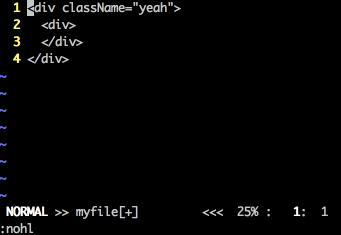

React Prop Vim Text Object
==========================

Depends on [vim-textobj-user](https://github.com/kana/vim-textobj-user).

TODO:

* Tests would be nice
* Finalize the design - I'm not convinced the current way it works is the nicest possible
* Docs

Demos
=====

`dar`

`cir`

